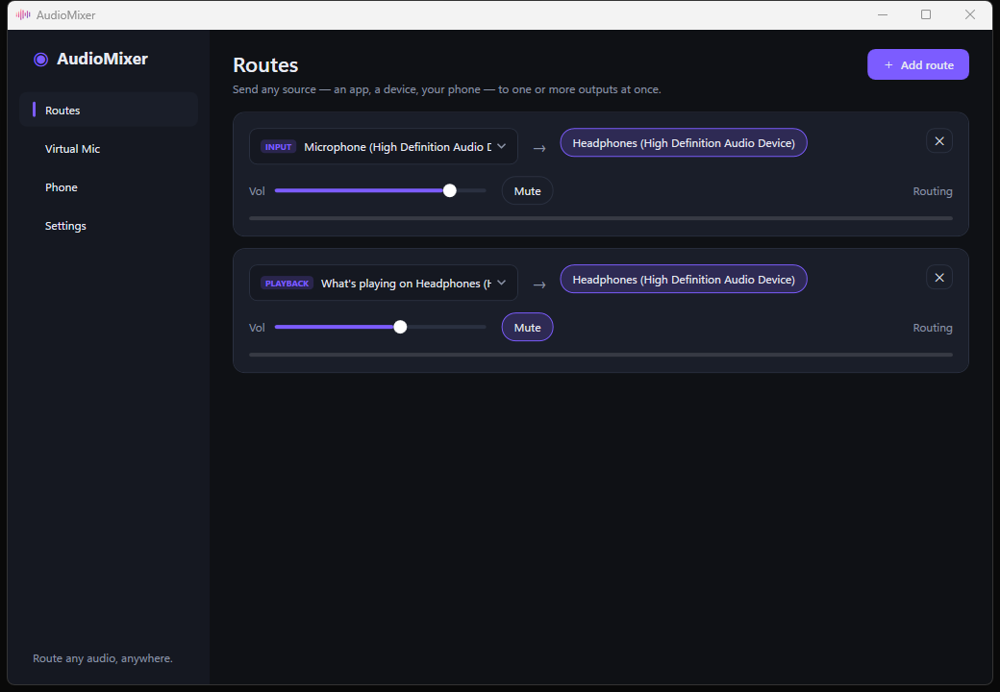
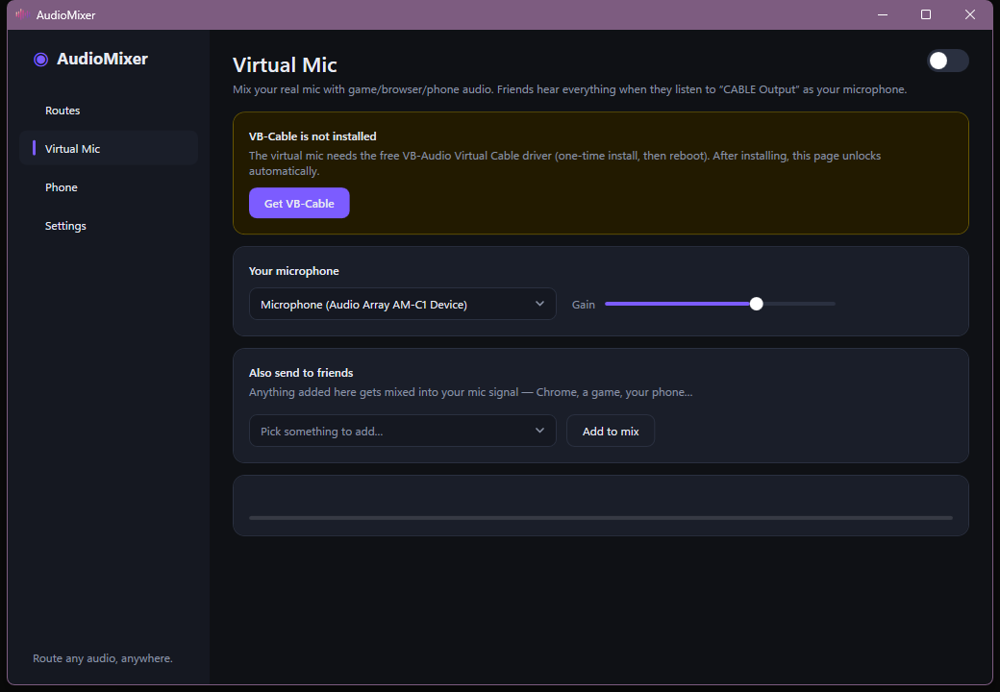
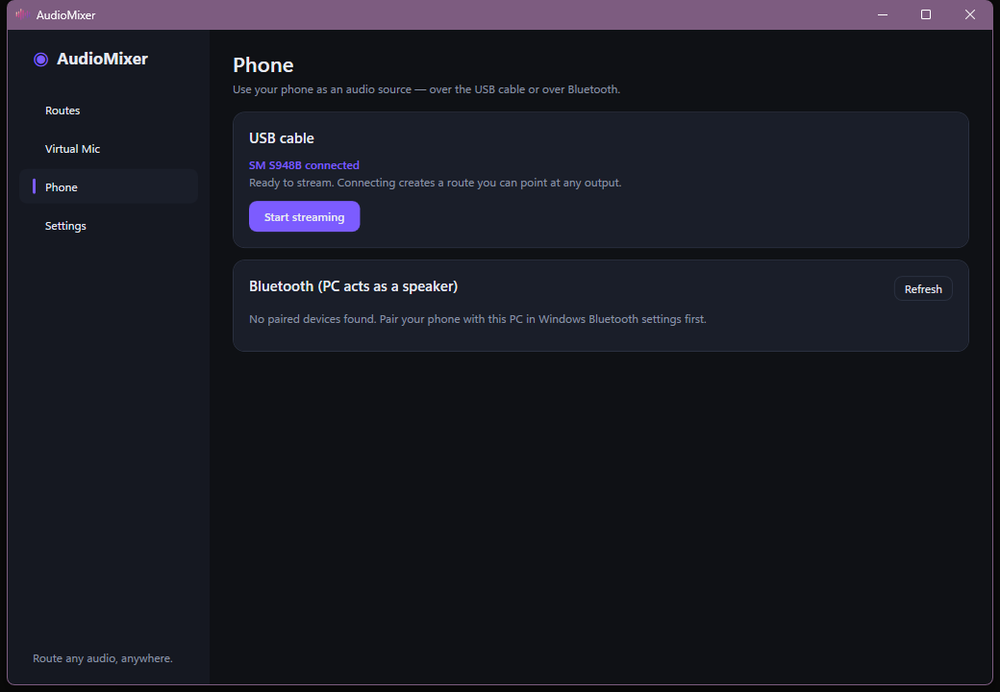
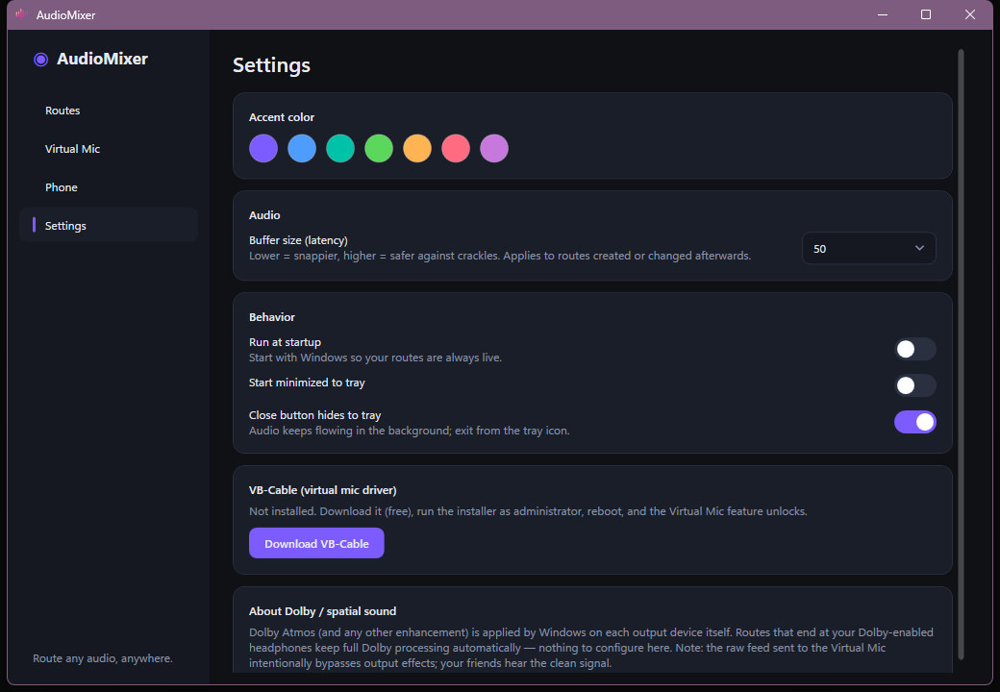

<div align="center">


# AudioMixer

### Windows audio router, virtual mic mixer, and phone-to-PC audio streamer

**Route any audio to any device. Send your phone's sound through USB or Bluetooth to your PC. Mix your microphone with game, browser, or phone audio into a virtual mic for Discord. Play one source to multiple headphones at once — all with external audio processing left intact.**

[](#requirements)
[](#requirements)
[](#license)

</div>

---

**AudioMixer** is a free (for personal/noncommercial use) Windows audio routing app for anyone who's ever wanted to:

- **Send audio from an Android phone to a PC over USB-C or Bluetooth**, without a cable-swap or a third-party app on the phone.
- **Play one audio source to two or more output devices simultaneously** — game audio on two headsets at once, a movie on speakers *and* headphones, etc.
- **Create a virtual microphone / virtual audio cable** that mixes your real mic with game, Discord, or browser sound, so people you're calling can hear your system audio too — without losing your voice.
- **Route a single application's sound** (Chrome, a game, Spotify) to a specific output device, independent of the Windows default.
- **Keep Dolby Atmos / Dolby Access working** on the final output device — AudioMixer doesn't touch device-level audio enhancements, so Dolby-enabled headphones stay Dolby-enabled.

If you've searched for *"send phone audio to PC"*, *"play audio to two devices Windows"*, *"virtual audio cable alternative"*, *"route Discord audio to specific speaker"*, *"USB audio from Android to PC"*, or *"soundboard mixer for streaming"* — this is that tool.

---

## Screenshots

<table>
<tr>
<td width="50%">

**Routes** — send any source to any combination of outputs


</td>
<td width="50%">

**Virtual Mic** — mix your mic with other app audio for Discord/calls


</td>
</tr>
<tr>
<td width="50%">

**Phone** — stream Android audio over USB or Bluetooth


</td>
<td width="50%">

**Settings** — accent color, latency, startup behavior, VB-Cable status


</td>
</tr>
</table>

---

## Features

| | |
|---|---|
| 🔀 **Multi-output routing** | Send one source — an app, a device, a mic — to **any number of outputs at once**. Perfect for two people on separate headsets hearing the same game. |
| 🎙️ **Virtual microphone mixer** | Blend your real mic with game/browser/phone audio into a single virtual mic input, so friends hear both your voice and what you're playing. |
| 📱 **Phone as an audio source (USB)** | Plug an Android phone into a USB-C port and stream its audio straight to any Windows output — no extra app on the phone, just a one-time "USB debugging" toggle. |
| 📶 **Phone as an audio source (Bluetooth)** | Turns your PC into a Bluetooth speaker so a phone can pair to it and pipe audio through Windows entirely wirelessly. |
| 🎯 **Per-application audio capture** | Grab just one app's sound (Chrome, a specific game, Spotify) without touching anything else on the system. |
| 🎧 **Dolby Atmos / Dolby Access compatible** | Effects are applied by Windows at the output device, so anything routed to a Dolby-enabled headphone endpoint keeps full Dolby processing. |
| 🎨 **Customizable, fast, reactive UI** | Live VU meters, accent color themes, adjustable buffer/latency, minimize-to-tray, run-at-startup. |
| 💾 **Persistent routes** | Every route and mix setting survives a restart — set it up once. |

---

## How it works

| Feature | Under the hood |
|---|---|
| Per-app capture | `ActivateAudioInterfaceAsync` + `AUDIOCLIENT_ACTIVATION_TYPE_PROCESS_LOOPBACK` (Windows 10 2004+) |
| Device loopback ("what's playing on X") | WASAPI loopback capture via [NAudio](https://github.com/naudio/NAudio) |
| Multi-output fan-out | One capture stream buffered independently into a `WasapiOut` per destination device |
| Virtual mic | NAudio `MixingSampleProvider` → the [VB-Audio Virtual Cable](https://vb-audio.com/Cable/) input endpoint |
| Phone audio over USB | Bundled `adb` + `scrcpy-server`, streaming raw 48 kHz PCM over a forwarded local socket |
| Phone audio over Bluetooth | `AudioPlaybackConnection` WinRT API — the PC advertises itself as an A2DP sink |

---

## Requirements

- Windows 10 (2004/build 19041) or Windows 11
- [.NET 8 Desktop Runtime](https://dotnet.microsoft.com/download/dotnet/8.0) (or the SDK, to build from source)
- [VB-Audio Virtual Cable](https://vb-audio.com/Cable/) *(free)* — only needed for the Virtual Mic feature
- An Android phone with USB debugging enabled *(only for USB phone streaming)*

## Build & run from source

```powershell
git clone <this-repo-url>
cd AudioMixer

# one-time: fetch adb + scrcpy-server, used for USB phone streaming
powershell -ExecutionPolicy Bypass -File scripts/fetch-tools.ps1

dotnet build AudioMixer.sln
dotnet run --project src/AudioMixer
```

Settings and routes are stored in `%APPDATA%\AudioMixer\settings.json`; runtime errors are logged to `error.log` in the same folder.

### Diagnostics

```powershell
AudioMixer.exe --dump-devices out.txt        # list outputs / inputs / audio-playing apps
AudioMixer.exe --selftest chrome result.txt  # capture an app, play it to the default output, report levels
```

## FAQ

**Does this replace Voicemeeter / VB-Cable / VoiceMod?**
It uses VB-Cable as its virtual audio device (rather than reinventing a kernel driver) but wraps it in a simpler routing UI focused on "source → outputs," multi-app mixing, and phone streaming — features those tools don't combine in one place.

**Will this break Dolby Atmos on my headset?**
No. Dolby processing is applied by Windows per output device. Any route that ends at your Dolby-enabled device keeps that processing.

**Do I need to install anything on my phone?**
No app install required. USB streaming needs a one-time "USB debugging" toggle in Android Developer Options; Bluetooth streaming just needs normal Bluetooth pairing.

**Does per-app audio capture work on Windows 7/8?**
No — it requires the Windows 10 2004+ process-loopback API. Device routing and the virtual mic mixer work on earlier Windows 10 builds too.

## License

[PolyForm Noncommercial License 1.0.0](LICENSE) — free to use, modify, and share for any **noncommercial purpose** (personal use, hobby projects, research, education, evaluation). **Commercial use requires a separate license from the copyright holder** — reach out to discuss terms/compensation before using AudioMixer (or a derivative) in a commercial product or for commercial gain.

## Keywords

*Windows audio router, virtual audio cable, virtual microphone Windows, route audio to multiple devices, play sound on two headphones Windows, phone audio to PC USB, Android audio to PC Bluetooth, per-app audio routing Windows, Discord virtual mic mixer, mix microphone and system audio, Dolby Atmos audio router, VB-Cable alternative, WASAPI loopback router, stream Android audio to Windows, audio splitter software Windows 11.*
